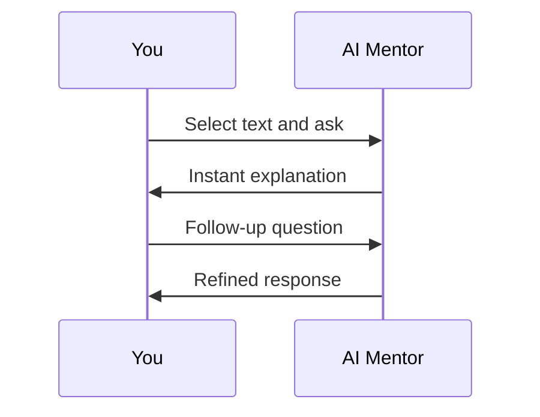

## Overview

Libro empowers you to master English through AI-mentored textbooks, interactive exercises, and progress tracking. Select content matched to your skill level, ask the AI mentor for real-time clarifications, visualize your advancement on the dashboard, and reinforce knowledge with targeted exercises. This guide walks you through each core feature.

<Columns cols={2}>
  <Card title="Personalized Textbooks" icon="book-open" href="/features/textbooks">
    Browse textbooks tailored to beginner, intermediate, or advanced levels.
  </Card>
  <Card title="AI Mentor Interactions" icon="zap" href="/features/ai-mentor">
    Get instant explanations and answers during reading.
  </Card>
  <Card title="Progress Dashboard" icon="trending-up" href="/features/dashboard">
    Track skill growth with visual charts and milestones.
  </Card>
  <Card title="Interactive Exercises" icon="check-circle" href="/features/exercises">
    Test understanding with quizzes and practical tasks.
  </Card>
</Columns>

## Navigating Personalized Textbooks by Skill Level

Start by finding textbooks that match your current abilities. Libro categorizes content into skill levels, ensuring you engage with material that's challenging yet achievable.

<Tabs>
  <Tab title="Beginner" icon="activity">
    Focus on foundational grammar and vocabulary.
    
    Visit the [library](https://book3.ai/library) and filter by `beginner` skills. Select a book like "Talking About Hobbies" to begin.
  </Tab>
  <Tab title="Intermediate" icon="target">
    Build conversational fluency and comprehension.
    
    Use the search at [book3.ai/find](https://book3.ai/find) with `intermediate` tags for topics like business English.
  </Tab>
  <Tab title="Advanced" icon="award">
    Dive into specialized domains like technical writing.
    
    Explore advanced filters in your [dashboard](https://book3.ai/dashboard) after logging in.
  </Tab>
</Tabs>

<Callout kind="tip">
  Bookmark frequently used textbooks in your library for quick access next time.
</Callout>

## Interacting with the AI Mentor

The AI mentor acts as your on-demand tutor. Highlight confusing sections or type questions directly in the reader interface.

<Steps>
  <Step title="Open a Textbook" icon="book-open">
    Navigate to [book3.ai/learn](https://book3.ai/learn) and pick a title.
  </Step>
  <Step title="Ask a Question" icon="message-circle">
    Click the chat icon and enter queries like "Explain this idiom" or "Translate to Japanese."
  </Step>
  <Step title="Refine Responses" icon="edit-3">
    Follow up with "Give an example" or "Make it simpler" for deeper understanding.
  </Step>
</Steps>



## Tracking Progress via Dashboard Visualizations

Monitor your learning journey with intuitive charts. Log in to https://book3.ai/dashboard to view completion rates, skill proficiency scores, and weekly trends.

<Expandable title="Understanding Dashboard Metrics" default-open="true">
  - **Completion Rate**: Percentage of textbook pages read.
  - **Skill Score**: Aggregated performance from exercises (0-100).
  - **Streak**: Consecutive days of activity.
  
  Set goals by clicking "Create Milestone" to target specific skills.
</Expandable>

## Completing Exercises to Reinforce Learning

Apply what you've learned through built-in quizzes and tasks. Exercises appear at chapter ends or via the practice tab.

<CodeGroup tabs="Multiple Choice,Fill-in-the-Blank">
  ```html
  <!-- Example exercise response structure -->
  <div class="quiz">
    <p>Choose the correct idiom: "Break a leg" means:</p>
    <label><input type="radio" value="a"> Good luck</label>
    <label><input type="radio" value="b"> Run away</label>
  </div>
  ```
  ```html
  <!-- Fill-in response -->
  <div class="quiz">
    <p>Complete: "I'm over the _____."</p>
    <input type="text" placeholder="moon">
    <!-- Answer: moon -->
  </div>
  ```
</CodeGroup>

<Callout kind="success">
  Aim for 80%+ on exercises before advancing. Retries are unlimited on the Advanced plan.
</Callout>

## Next Steps

<Columns cols={2}>
  <Card title="Upgrade to Advanced" icon="arrow-up" href="https://book3.ai/pricing" horizontal>
    Unlock unlimited AI chats and all textbooks.
  </Card>
  <Card title="Join the Community" icon="users" href="https://book3.ai/#" horizontal>
    Share progress and tips with other learners.
  </Card>
</Columns>

<Expandable title="Frequently Asked Questions">
  ### Can I switch skill levels mid-book?
  Yes, pause and search for alternatives anytime.
  
  ### How accurate is the AI mentor?
  Trained on expert content with 95%+ reliability for English topics.
</Expandable>