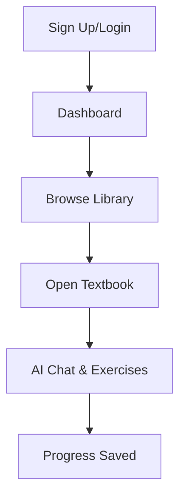

## Prerequisites

<Callout kind="info">

Before starting, ensure you have:
- A Google account (recommended for quick signup) or a valid email address
- A modern web browser like Chrome or Firefox
- Internet connection for accessing `https://libro.ai`

No software installation required—everything runs in your browser.

</Callout>

## Sign Up for an Account

Libro offers two simple signup methods. Choose the one that suits you best.

<Tabs>
  <Tab title="Google" icon="apple">

    <Steps>
      <Step title="Visit Signup Page" icon="external-link">
        Navigate to `https://libro.ai/signup`.
      </Step>
      <Step title="Select Google Option">
        Click the **"Sign up with Google"** button.
      </Step>
      <Step title="Authorize Access">
        Review permissions and click **Allow**. You'll be redirected to your dashboard.
      </Step>
    </Steps>

  </Tab>
  <Tab title="Email" icon="mail">

    <Steps>
      <Step title="Visit Signup Page" icon="external-link">
        Go to `https://libro.ai/signup`.
      </Step>
      <Step title="Enter Details">
        Provide your email, create a password, and fill in your name.
      </Step>
      <Step title="Verify Email">
        Check your inbox for a verification link and click it to activate your account.
      </Step>
    </Steps>

  </Tab>
</Tabs>

<Callout kind="tip">
  Free plan includes access to 24+ textbooks and limited AI chats. Upgrade later for unlimited access.
</Callout>

## Access Your Dashboard

Once signed up:

<Steps>
  <Step title="Log In" icon="log-in">
    Return to `https://libro.ai/login` if needed and sign in.
  </Step>
  <Step title="View Progress">
    Your dashboard shows skill levels, recent activity, and available textbooks.
  </Step>
  <Step title="Explore Library">
    Click **Library** in the navigation to browse free textbooks.
  </Step>
</Steps>

## Select and Start a Textbook

1. From the dashboard, select **Browse Textbooks** or visit `https://libro.ai/library`.
2. Filter by skill level (beginner-friendly options available) or search for topics like "Talking about Hobbies".
3. Click a textbook to open it.

<Expandable title="Pro Tip: Random Start" default-open="false">

  For a quick session, use `https://libro.ai/learn/talking-about-hobbies` to jump into a beginner textbook immediately.

</Expandable>

## Initiate AI-Mentored Session

With the textbook open:

<Steps>
  <Step title="Read Content" icon="book-open">
    Scroll through the material. AI highlights key sections automatically.
  </Step>
  <Step title="Ask Questions" icon="message-circle">
    Use the chat panel to query: "Explain this grammar rule" or "Give an example".
  </Step>
  <Step title="Complete Exercises">
    Answer quizzes at the end. Track progress in real-time on the dashboard.
  </Step>
</Steps>

## Next Steps

<Columns cols={2}>
  <Card title="Introduction" icon="book-open" href="/introduction">
    Learn core features and platform overview.
  </Card>
  <Card title="Authentication" icon="shield" href="/authentication">
    Advanced login options and security.
  </Card>
  <Card title="Guides" icon="help-circle" href="/guides">
    Deep dives into skills and exercises.
  </Card>
  <Card title="Changelog" icon="git-branch" href="/changelog">
    Stay updated with new features.
  </Card>
</Columns>

<Callout kind="success">
  Congratulations! You've completed your first session. Bookmark `https://libro.ai` and return daily to build English skills with AI support.
</Callout>